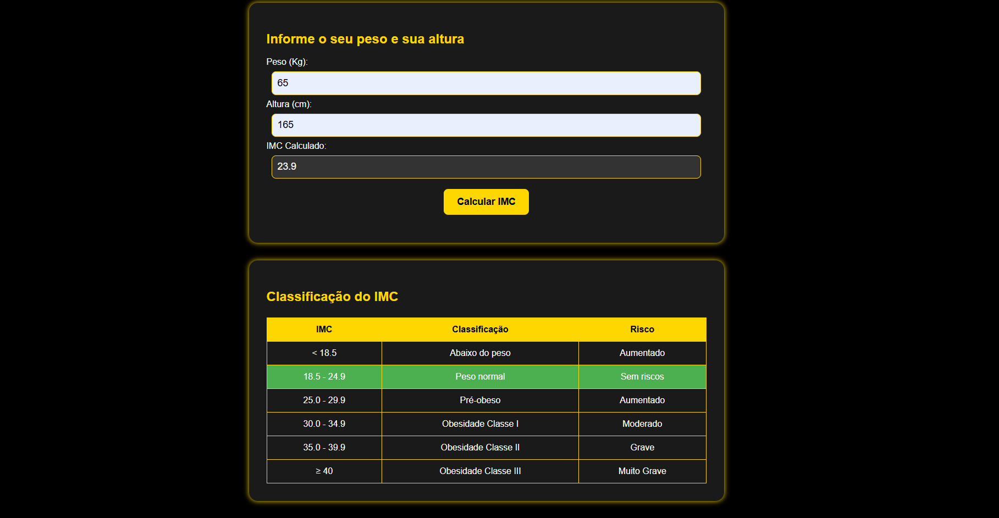

# 🏋️ Calculadora de IMC



Uma aplicação web que calcula o Índice de Massa Corporal (IMC) e classifica o resultado conforme padrões da OMS, com visualização interativa das faixas de peso.

## ✨ Funcionalidades
- **Cálculo automático de IMC** a partir de peso (kg) e altura (cm).
- **Classificação visual** com cores para cada faixa de IMC:
  - Verde: Peso normal
  - Amarelo: Pré-obeso
  - Vermelho: Obesidade ou abaixo do peso
- **Tabela de referência** com riscos associados.

## 🛠️ Tecnologias
- **HTML5**: Estrutura semântica
- **CSS3**: Design moderno com tema escuro e detalhes em dourado
- **JavaScript**: Lógica de cálculo e interatividade

Veja o portfólio funcionando ao vivo:

👉 [Eduardo Peçanha — Portfólio Online](https://eduardopec.github.io/calculadorDeImc/)

## 🚀 Como Executar
1. Clone o repositório:
   ```bash
   git clone https://github.com/EduardoPec/calculadorDeImc
